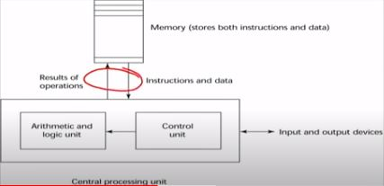

Compiladores:

É um programa capaz de transformar um texto escrito em um computador em um programa executado pela máquina.

Conceito de linguagens de programação:

- Sintática: Usar a notação adequada

- Semântica: Conceitos usados para resolver um problemas de programação
(o que significa um if, while...)

um linguagem de programação é criada a partir da necessidade dos 3 pilares (usuários, desenvolvedores, aplicações). Determinadas aplicações acabam exigindo linguagens de programação distintas (web, ai, aplicações científicas...)

Categorias de Linguagens

1 - Imperativa
2 - Declarativas (Funcionais e Lógicas)
3 - Orientadas a Objetos

OBS: A Arquitetura de Von Neumann
acabou geranda as linguagens imperativas por conta  do gargalo no barramento de dados

Análise léxica:

REFERÊNCIAS:

Engenharia de Computação Univesp – 18º Bimestre - UNIVESP - https://www.youtube.com/watch?v=lfGqYLYXdSY&list=PLxI8Can9yAHdmCAoLW5KWCG5ZrnfwrWXV

Aulas de Computação - https://www.youtube.com/watch?v=8rB8Dvczc1g&list=PL0Z-gyL9saMcajYH26KWKQG0nH2C2fsMQ

Linguagem Compilada vs Interpretada | Qual é melhor? - Fabio Akita - https://www.youtube.com/watch?v=SNyh-cubxaU
